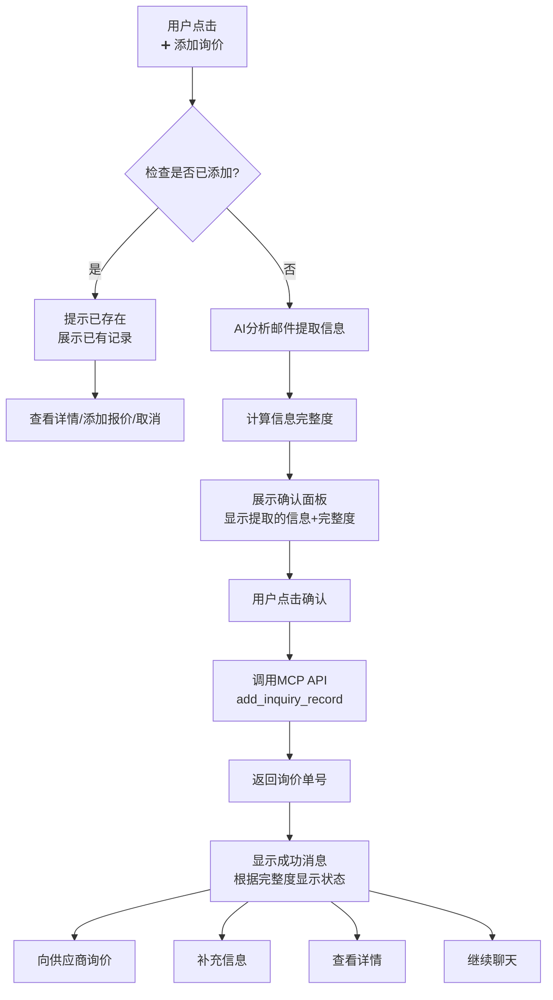
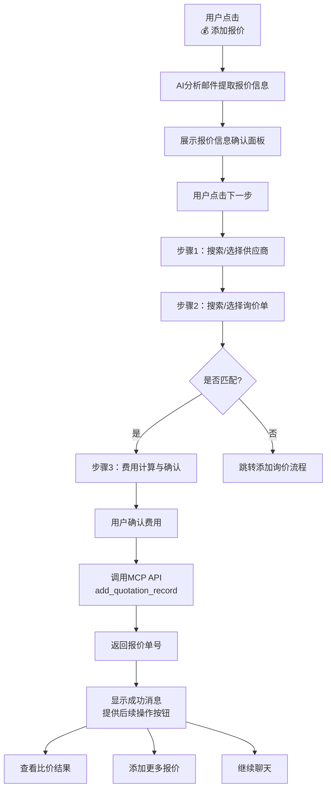
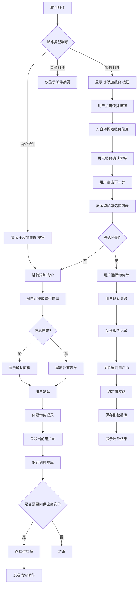
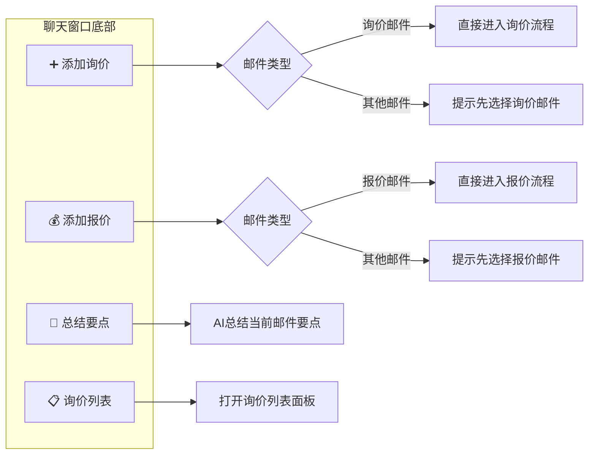
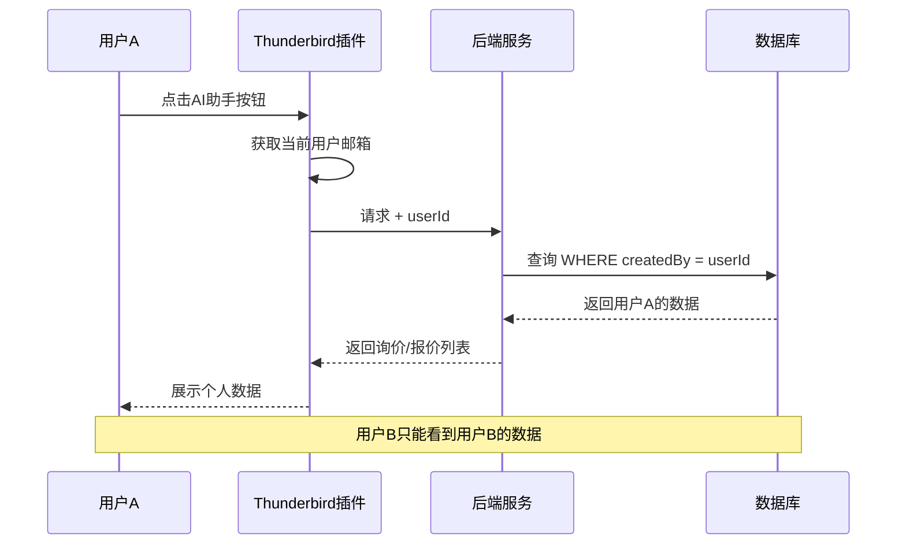
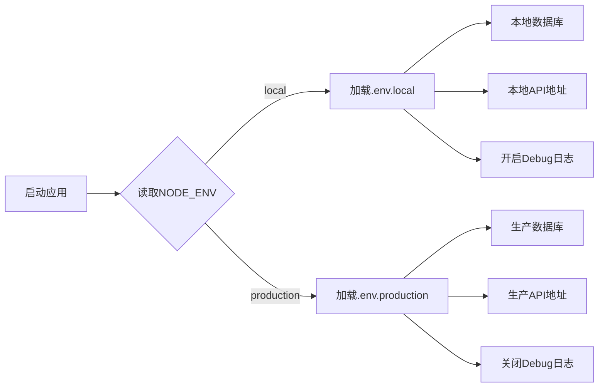
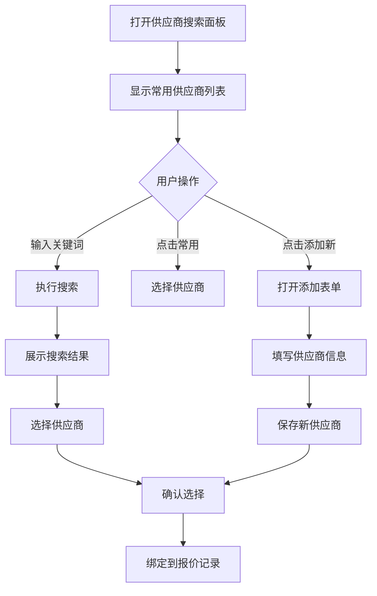

# AI 邮件助手 - 业务需求文档

## 项目背景

为货运代理业务人员开发 AI 邮件助手，帮助快速分析邮件中的报价、询价信息，提升工作效率。

## 核心功能

### 1. 邮件智能分析

- 自动识别邮件中的询价信息（起运港、目的港、货物品名、体积/重量、箱型等）
- 自动识别邮件中的报价信息（海运费、本地费、有效期等）
- AI 分析后主动提示业务人员是否需要添加询价记录和报价记录，以及是否需要绑定供应商。

### 2. 多用户数据隔离

**原则：自己添加的询价、报价记录，自己看得到**

**实现机制：**

- 每个用户通过 Thunderbird 账号或系统账号唯一标识
- 所有询价记录、报价记录关联创建者 userId
- 查询时自动过滤当前用户的记录
- 支持管理员查看所有记录（可选权限）

**数据模型扩展：**

```javascript
// 用户标识
userId: string,           // 用户唯一标识（邮箱或系统账号）
userName: string,         // 用户显示名称

// 询价记录增加字段
createdBy: string,        // 创建者 userId
createdAt: timestamp,     // 创建时间
updatedBy: string,        // 最后修改者
updatedAt: timestamp,     // 最后修改时间

// 报价记录增加字段
createdBy: string,        // 创建者 userId
createdAt: timestamp,     // 创建时间
```

**MCP API 扩展：**

```javascript
// 获取当前用户的询价记录
mcpTool: "get_my_inquiries"
parameters: {
  userId: string,         // 当前用户ID
  status: string,         // 状态筛选（可选）
  startDate: string,      // 开始日期（可选）
  endDate: string         // 结束日期（可选）
}

// 获取当前用户的报价记录
mcpTool: "get_my_quotations"
parameters: {
  userId: string,         // 当前用户ID
  inquiryId: string,      // 关联询价单号（可选）
  supplierId: string,     // 供应商ID（可选）
}
```

### 3. 询价记录管理

**触发条件：** AI 检测到邮件包含询价信息

**快捷按钮入口：**

- 聊天窗口底部快捷按钮栏显示 **「➕ 添加询价」**
- 点击后直接进入询价添加流程

**核心原则：**

- **无论信息是否完整，都可以添加询价记录**
- **添加前检查是否已添加过该邮件的询价，避免重复**
- **信息不完整时，标记为"待补充"状态**

**交互流程（带快捷按钮）：**

````
用户点击 [➕ 添加询价] 按钮
    ↓
AI: 正在检查该邮件是否已添加过询价...
    （根据邮件 messageId 查询数据库）
    ↓
【情况1：已添加过】
AI: ⚠️ 该邮件已添加过询价记录
    单号：INQ-2024-001
    状态：询价中
    
    [查看详情] [添加报价] [取消]

【情况2：未添加过】
AI: 正在分析邮件中的询价信息...
    ↓
AI 自动提取并展示（JSON格式）：
    ```json
    {
      "客户": "ABC Trading",
      "客户来源": "从发件人提取",
      "起运港(POL)": "Shanghai",
      "目的港(POD)": "Los Angeles",
      "货物品名": "Electronics",
      "箱型": "1x40HQ",
      "体积(CBM)": 60,
      "重量(KG)": 18000,
      "预计出货时间": "2024-07-15",
      "特殊要求": "需要温控",
      "信息来源": "AI识别"
    }
    ```
    
    信息完整度: 85%
    
    [确认添加] [修改信息] [取消]
    ↓
用户点击 [确认添加]
    ↓
AI: ✅ 已添加询价记录
    单号：INQ-2024-001
    创建者：张三
    状态：✅ 信息完整 / ⚠️ 待补充（起运港缺失）
    
    [向供应商询价] [补充信息] [查看详情] [继续聊天]
````

**信息完整度规则：**

| 完整度    | 状态      | 处理                    |
| ------ | ------- | --------------------- |
| 100%   | ✅ 信息完整  | 直接添加，状态为"询价中"         |
| 60-99% | ⚠️ 部分缺失 | 添加成功，状态为"待补充"，提示缺失字段  |
| <60%   | ❌ 信息不足  | 添加成功，状态为"草稿"，必须补充关键字段 |

**快捷按钮状态流转：**



**重复检查机制（基于 messageId）：**

```javascript
// 添加前检查 - 使用 Thunderbird 邮件唯一标识 messageId
mcpTool: "check_inquiry_exists"
parameters: {
  messageId: string,      // Thunderbird 邮件唯一标识（必填）
  userId: string          // 当前用户ID（必填）
}
returns: {
  exists: boolean,        // 是否已存在
  inquiryId: string,      // 已存在的询价单号
  status: string          // 已存在记录的状态
}
```

**messageId 获取方式：**

```javascript
// 在 background.js 中获取邮件的 messageId
const message = await browser.messageDisplay.getDisplayedMessage(tab.id);
const messageId = message.id;  // Thunderbird 邮件唯一标识

// 传递给聊天窗口
browser.tabs.sendMessage(chatTabId, {
  type: 'emailContent',
  messageId: message.id,    // 用于重复检查
  subject: message.subject,
  from: formatAuthor(message.author),
  date: formatDate(message.date),
  conversation: conversation
});
```

**需要字段：**

- 客户信息（从邮件发件人自动获取）
- 起运港 (POL)
- 目的港 (POD)
- 货物品名
- 箱型/体积
- 预计出货时间
- 邮件原文链接
- **创建者 (createdBy)** - 自动填充当前用户ID
- **信息完整度 (completeness)** - 自动计算
- **状态 (status)** - 根据完整度自动设置

### 4. 报价记录管理

**业务关系：**

- 询价 : 报价 = 1 : N（一个询价可以收到多个供应商的报价）
- 报价 : 供应商 = 1 : 1（一个报价对应一个供应商）

**触发条件：**

- AI 检测到邮件包含报价信息
- 业务人员主动要求记录报价
- 从询价记录发起向供应商询价后收到回复

**快捷按钮入口：**

- 聊天窗口底部快捷按钮栏显示 **「💰 添加报价」**
- 点击后直接进入报价添加流程

**交互流程（带快捷按钮）：**

````
用户点击 [💰 添加报价] 按钮
    ↓
AI: 正在分析邮件中的报价信息...
    ↓
AI 自动提取并展示（JSON格式）：
    ```json
    {
      "供应商": "MSC Shipping",
      "供应商来源": "从邮件签名提取",
      "起运港(POL)": "Shanghai",
      "目的港(POD)": "Los Angeles",
      "海运费(USD)": 3200,
      "本地费(USD)": 450,
      "箱型": "1x40HQ",
      "有效期": "2024-06-30",
      "运输时间": "14 days",
      "船名": "MSC Leo",
      "信息来源": "AI识别"
    }
    ```
    
    [下一步：选择供应商和询价单]
    ↓
【步骤1：选择供应商】
AI: 请选择或搜索供应商：
    ┌──────────────────────────────────────────┐
    │ 🔍 搜索供应商...                         │
    ├──────────────────────────────────────────┤
    │ ○ 上海远洋物流 (匹配度 85%)              │
    │ ○ 宁波港务集团 (匹配度 72%)              │
    │ ○ 厦门联合航运 (匹配度 68%)              │
    │ ○ + 添加新供应商                         │
    └──────────────────────────────────────────┘
    
    用户搜索 "MSC" 或选择 "+ 添加新供应商"
    ↓
【步骤2：选择询价单】
AI: 请选择要关联的询价单：
    ┌──────────────────────────────────────────┐
    │ 🔍 搜索询价单...                         │
    ├──────────────────────────────────────────┤
    │ ○ INQ-2024-001  SHA→LAX  Electronics    │
    │ ○ INQ-2024-002  NGB→NYC  Machinery      │
    │ ○ INQ-2024-003  SHA→ROT  Chemicals      │
    └──────────────────────────────────────────┘
    
    [确认关联] [没有匹配，新建询价]
    ↓
【步骤3：费用计算与确认】
AI: 请确认报价信息：
    ```json
    {
      "供应商": "MSC Shipping",
      "关联询价": "INQ-2024-001",
      "路线": "Shanghai → Los Angeles",
      "箱型": "1x40HQ",
      "费用明细": {
        "海运费(USD)": 3200,
        "本地费(USD)": 450,
        "其他费用(USD)": 0,
        "总费用(USD)": 3650
      },
      "有效期": "2024-06-30"
    }
    ```
    
    [确认添加] [修改费用] [取消]
    ↓
用户确认
    ↓
AI: ✅ 已添加报价记录
    报价单号：QUO-2024-003
    关联询价：INQ-2024-001
    供应商：MSC Shipping
    总费用：$3,650
    
    [查看比价] [添加更多报价] [继续聊天]
````

**快捷按钮状态流转：**



**供应商搜索功能：**

```javascript
// 搜索供应商
mcpTool: "search_supplier"
parameters: {
  keyword: string,         // 搜索关键词（公司名称/邮箱/电话）
  emailDomain: string,     // 邮箱域名（可选）
  userId: string           // 当前用户ID（用于筛选常用供应商）
}
returns: {
  suppliers: [{
    id: string,
    name: string,
    matchScore: number,    // 匹配度分数
    contact: string,
    email: string,
    isFrequent: boolean    // 是否常用供应商
  }]
}
```

**询价单搜索功能：**

```javascript
// 搜索当前用户的询价单
mcpTool: "search_inquiries"
parameters: {
  userId: string,          // 当前用户ID（必填）
  keyword: string,         // 搜索关键词（单号/路线/品名）
  pol: string,             // 起运港筛选（可选）
  pod: string,             // 目的港筛选（可选）
  status: string           // 状态筛选（可选）
}
returns: {
  inquiries: [{
    id: string,
    pol: string,
    pod: string,
    cargoName: string,
    containerType: string,
    inquiryDate: string,
    status: string
  }]
}
```

**费用计算规则：**

```javascript
// 费用计算
const quotation = {
  ofRate: 3200,           // 海运费（Ocean Freight）
  localCharges: 450,      // 本地费（Local Charges）
  otherCharges: 0,        // 其他费用
  // 自动计算
  totalCost: function() {
    return this.ofRate + this.localCharges + this.otherCharges;
  }
};

// 存储时自动计算总费用
totalCost: quotation.ofRate + quotation.localCharges + quotation.otherCharges
```

**需要字段：**

- **关联询价单号** (inquiryId) - 必填，报价必须绑定到某个询价
- 供应商信息 (supplierId, supplierName) - 必填
- 起运港-目的港 (pol, pod)
- 海运费 (ofRate)
- 本地费 (localCharges)
- 有效期 (validDate)
- 箱型 (containerType)
- 邮件ID (emailId)
- 报价日期 (quoteDate)
- **创建者 (createdBy)** - 自动填充当前用户ID

## 环境适配

### 项目实际环境配置

根据项目代码，环境变量通过以下方式管理：

**主服务** (`src/backend/server.js`):

```javascript
// 加载环境变量
const envFile = process.env.NODE_ENV === 'production' ? 'prod.env' : 'local.env';
dotenv.config({ path: `${process.cwd()}/${envFile}` });

const PORT = process.env.PORT || 3002;
const SILICONFLOW_API_KEY = process.env.SILICONFLOW_API_KEY || 'YOUR_API_KEY';
const ACCESS_PASSWORD = process.env.ACCESS_PASSWORD || 'koudai123';
```

**MCP服务** (`src/backend/server-mcp.js`):

```javascript
dotenv.config();
const PORT = process.env.PORT || 3000;
```

### 环境变量文件

项目根目录需要创建以下环境文件：

**`local.env`** **(本地开发)**

```bash
# SiliconFlow AI API 配置
SILICONFLOW_API_KEY=YOUR_API_KEY_HERE

# 服务器端口
PORT=3000

# 访问密码（用于保护 API 接口）
ACCESS_PASSWORD=koudai123

# API 基础地址（本地开发）
API_BASE_URL=http://localhost:3000
```

**`prod.env`** **(生产环境)**

```bash
# SiliconFlow AI API 配置
SILICONFLOW_API_KEY=YOUR_PRODUCTION_API_KEY

# 服务器端口
PORT=3000

# 访问密码（生产环境使用强密码）
ACCESS_PASSWORD=your_strong_password

# API 基础地址（生产环境）
API_BASE_URL=https://koudai.xin
```

**`.env.example`** **(模板文件)**

```bash
# SiliconFlow AI API 配置
# 获取 API Key: https://cloud.siliconflow.cn/
SILICONFLOW_API_KEY=YOUR_API_KEY_HERE

# 服务器端口
PORT=3000

# 访问密码（用于保护 API 接口）
ACCESS_PASSWORD=koudai123
```

### 环境切换逻辑

```javascript
// 主服务环境切换
const envFile = process.env.NODE_ENV === 'production' ? 'prod.env' : 'local.env';
dotenv.config({ path: `${process.cwd()}/${envFile}` });

// MCP服务环境切换
dotenv.config(); // 默认加载 .env 文件
```

### 启动方式

**本地开发：**

```bash
# 主服务（端口 3002）
node src/backend/server.js

# MCP服务（端口 3000）
node src/backend/server-mcp.js

# 或使用 PM2
pm2 start ecosystem.config.cjs
```

**生产环境：**

```bash
# 设置环境变量后启动
NODE_ENV=production node src/backend/server.js
NODE_ENV=production node src/backend/server-mcp.js
```

## 工作流

### 整体业务流程（含快捷按钮）



### 快捷按钮交互流程



### 多用户数据隔离流程



### 环境切换流程



## 技术实现

### MCP API 接口设计

```javascript
// 添加询价记录
mcpTool: "add_inquiry_record"
parameters: {
  // 用户标识
  userId: string,               // 当前用户ID（必填）
  userName: string,             // 当前用户名称
  
  // 邮件标识（用于重复检查）
  messageId: string,            // Thunderbird 邮件唯一标识（必填）
  
  // 基本信息（从邮件自动提取）
  customerId: string,           // 客户ID（从邮件发件人匹配，可选）
  customerName: string,         // 客户名称（从邮件发件人提取）
  emailId: string,              // 邮件ID
  emailSubject: string,         // 邮件主题
  emailContent: string,         // 邮件原文（AI从中提取询价信息）
  inquiryDate: string,          // 询价日期（默认邮件日期）
  
  // 询价信息（AI从邮件内容提取为JSON格式）
  extractedData: {              // AI提取的结构化数据
    pol: string,                // 起运港
    pod: string,                // 目的港
    cargoName: string,          // 货物品名
    containerType: string,      // 箱型
    volume: number,             // 体积(CBM)
    weight: number,             // 重量(KG)
    etd: string,                // 预计出货时间
    specialRequirements: string // 特殊要求
  },
  completeness: number,         // 信息完整度百分比（0-100）
  status: string                // 状态：inquiry/draft/pending
}


// 添加报价记录
mcpTool: "add_quotation_record"
parameters: {
  // 用户标识
  userId: string,               // 当前用户ID（必填）
  userName: string,             // 当前用户名称
  
  // 邮件标识（用于重复检查）
  messageId: string,            // Thunderbird 邮件唯一标识（必填）
  
  // 关联信息（必须）
  inquiryId: string,            // 关联询价单号（必须）
  supplierId: string,           // 供应商ID
  supplierName: string,         // 供应商名称
  
  // 邮件信息
  emailId: string,              // 邮件ID
  emailContent: string,         // 邮件原文
  quoteDate: string,            // 报价日期
  
  // 报价信息（AI从邮件内容提取为JSON格式）
  extractedData: {              // AI提取的结构化数据
    pol: string,                // 起运港
    pod: string,                // 目的港
    ofRate: number,             // 海运费
    localCharges: number,       // 本地费
    otherCharges: number,       // 其他费用
    totalCost: number,          // 总费用（自动计算）
    containerType: string,      // 箱型
    validDate: string,          // 有效期
    transitTime: string,        // 运输时间
    vesselName: string,         // 船名
    remarks: string             // 备注
  }
}


// 搜索供应商
mcpTool: "search_supplier"
parameters: {
  keyword: string,         // 搜索关键词（公司名称/邮箱/电话）
  emailDomain: string      // 邮箱域名
}

// 获取当前用户的询价记录
mcpTool: "get_my_inquiries"
parameters: {
  userId: string,         // 当前用户ID（必填）
  status: string,         // 状态筛选（可选）
  startDate: string,      // 开始日期（可选）
  endDate: string         // 结束日期（可选）
}

// 获取当前用户的报价记录
mcpTool: "get_my_quotations"
parameters: {
  userId: string,         // 当前用户ID（必填）
  inquiryId: string,      // 关联询价单号（可选）
  supplierId: string,     // 供应商ID（可选）
}

// 获取询价的所有报价（1:N 查询）
mcpTool: "get_quotations_by_inquiry"
parameters: {
  inquiryId: string,      // 询价单号
  userId: string          // 当前用户ID（用于权限验证）
}
returns: {
  inquiry: object,         // 询价信息
  quotations: array        // 该询价下的所有报价列表
}

// 获取供应商的所有报价（用于分析供应商历史价格）
mcpTool: "get_quotations_by_supplier"
parameters: {
  supplierId: string,      // 供应商ID
  userId: string,          // 当前用户ID（用于权限验证）
  pol: string,             // 起运港（可选）
  pod: string              // 目的港（可选）
}
```

### 供应商绑定方案（手动搜索模式）

**核心原则：用户手动搜索并选择供应商，系统提供智能辅助**

**交互流程：**

```
【步骤1：打开供应商搜索面板】
AI: 请选择或搜索供应商：
    ┌──────────────────────────────────────────┐
    │ 🔍 输入供应商名称、邮箱或电话...         │
    ├──────────────────────────────────────────┤
    │ 📌 常用供应商（基于当前用户历史）        │
    │ ○ 上海远洋物流  📧 shanghai@ocean.com    │
    │ ○ 宁波港务集团  📧 wang@nbport.com       │
    │ ○ 厦门联合航运  📧 chen@unishipping.com  │
    ├──────────────────────────────────────────┤
    │ 🔍 搜索结果                              │
    │ ○ MSC Shipping  📧 msc@shipping.com      │
    │ ○ MSC Agency    📧 agency@msc.com        │
    ├──────────────────────────────────────────┤
    │ [+ 添加新供应商]                         │
    └──────────────────────────────────────────┘
    
    用户输入 "MSC" 进行搜索
    ↓
【步骤2：选择或添加供应商】
用户点击 "MSC Shipping"
    ↓
AI: 已选择供应商：MSC Shipping
    邮箱：msc@shipping.com
    电话：+86 21 1234 5678
    
    [确认选择] [重新搜索] [添加新供应商]
    ↓
【步骤3：确认绑定】
用户确认后，供应商与报价记录绑定
```

**搜索功能：**

```javascript
// 搜索供应商（支持多字段模糊匹配）
mcpTool: "search_supplier"
parameters: {
  keyword: string,         // 搜索关键词（公司名称/邮箱/电话/联系人）
  userId: string,          // 当前用户ID（用于筛选常用供应商）
  limit: number            // 返回结果数量限制（默认10条）
}
returns: {
  suppliers: [{
    id: string,
    name: string,           // 供应商名称
    contact: string,        // 联系人
    email: string,          // 邮箱
    phone: string,          // 电话
    address: string,        // 地址
    isFrequent: boolean,    // 是否常用（基于当前用户历史）
    lastUsed: string        // 最近使用时间
  }],
  total: number             // 总结果数
}
```

**添加新供应商：**

```javascript
// 添加新供应商到系统
mcpTool: "add_supplier"
parameters: {
  userId: string,          // 当前用户ID（必填）
  name: string,            // 供应商名称（必填）
  contact: string,         // 联系人
  email: string,           // 邮箱
  phone: string,           // 电话
  address: string,         // 地址
  products: [string],      // 服务产品
  remarks: string          // 备注
}
returns: {
  supplierId: string,      // 新供应商ID
  success: boolean,
  message: string
}
```

**供应商选择状态流转：**



## 用户交互示例

### 场景一：收到询价邮件

```
AI: 检测到询价信息：
    - 客户: ABC Trading
    - 路线: Shanghai → Los Angeles
    - 货物品名: Electronics
    - 箱型: 1x40HQ
    
    是否需要添加到询价记录？
    [是] [否] [稍后提醒]

用户: 是

AI: 已添加询价记录，单号：INQ-2024-001
    创建者：张三
    是否需要向供应商发起询价？
    [选择供应商] [暂不发起]
```

### 场景二：收到报价邮件

```
AI: 检测到报价信息：
    - 供应商: MSC Shipping
    - 路线: Shanghai → Los Angeles
    - 箱型: 1x40HQ
    - 海运费: $3200
    - 有效期: 2024-06-30
    
    匹配到您的询价单：INQ-2024-001 (ABC Trading)
    是否为该询价的报价？
    [是] [不是，重新选择询价] [先创建新询价]

用户: 是

AI: 请确认供应商：
    1. MSC Shipping (匹配度 95%)
    2. MSC Agency
    3. 添加新供应商
    
用户: 选择 1

AI: 已添加报价记录：
    - 报价单号：QUO-2024-003
    - 关联询价：INQ-2024-001
    - 供应商：MSC Shipping
    - 价格：$3200
    - 创建者：张三
    
    该询价目前已有 3 个报价：
    1. MSC - $3200 ⭐ 最低
    2. MSK - $3500
    3. CMA - $3350
```

### 场景三：查看我的询价记录

```
用户: 查看我的询价记录

AI: 张三的询价记录（共 5 条）：
    
    ┌─────────────┬─────────────┬──────────┬──────────┬──────────┐
    │ 单号        │ 客户        │ 路线     │ 状态     │ 日期     │
    ├─────────────┼─────────────┼──────────┼──────────┼──────────┤
    │ INQ-2024-005│ XYZ Corp    │ SHA→LAX  │ 询价中   │ 06-15    │
    │ INQ-2024-004│ ABC Trading │ SHA→NYC  │ 已报价   │ 06-10    │
    │ INQ-2024-003│ DEF Ltd     │ BJ→HKG   │ 已完成   │ 06-05    │
    └─────────────┴─────────────┴──────────┴──────────┴──────────┘
```

## 后续优化

1. **智能匹配**：自动关联询价和报价记录
2. **价格比较**：同一航线多供应商报价对比
3. **到期提醒**：报价有效期到期前自动提醒
4. **客户画像**：分析客户询价偏好、活跃航线
5. **供应商评级**：基于报价响应速度、价格竞争力评分
6. **团队协作**：支持询价单分配给团队成员处理
7. **数据导出**：支持询价/报价记录导出 Excel

